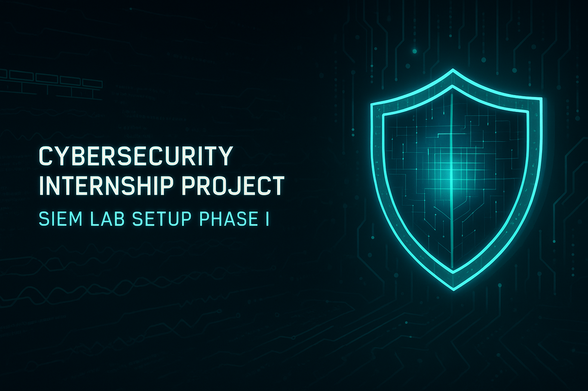
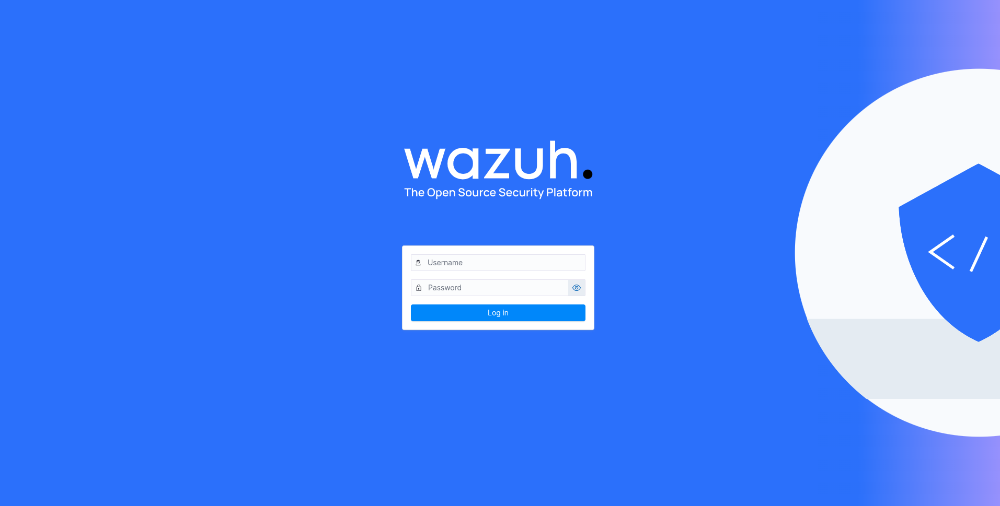
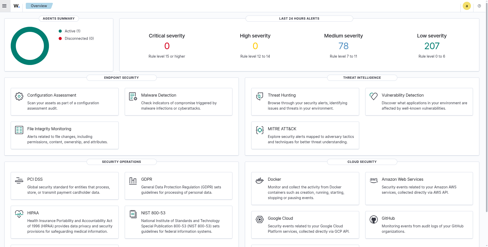
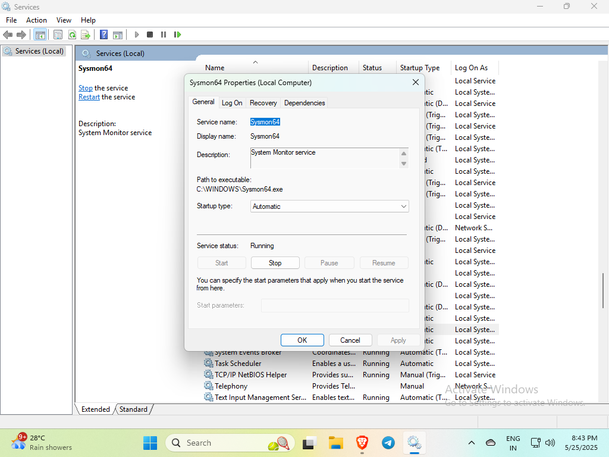
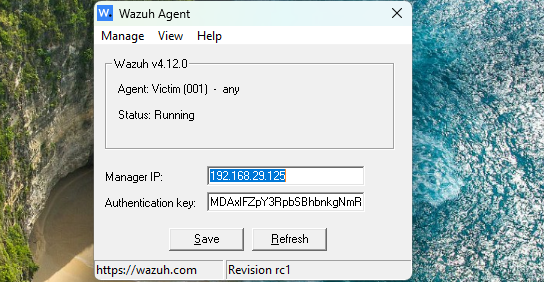
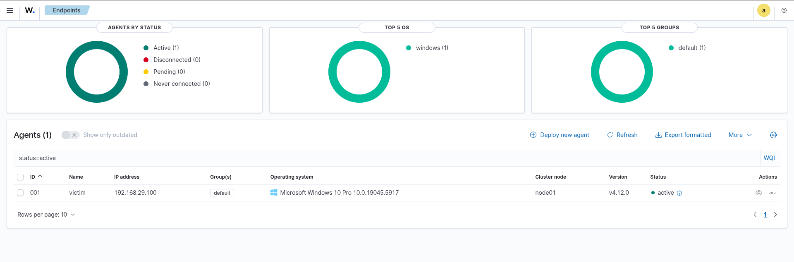

# 🛡️ Phase I: Foundation Setup — Your Cybersecurity War Room


 
**Objective:** Build a personal cybersecurity lab environment and configure basic monitoring and detection capabilities.

---

## 🎯 Phase Goals

- Set up a virtual SOC environment
- Configure log generation and forwarding
- Implement basic detection rules
- Track progress and maintain documentation

---

## 🛠️ Tools Used

| Category        | Tool              |
|----------------|-------------------|
| SIEM            | Wazuh             |
| Log Source      | Windows 11 (On-premise desktop)   |
| Log Agent       | Wazuh Agent, Sysmon|
| Wazuh Manager/Indexer/Dashboard + Attacker | Kali Linux (On-premise Laptop) |

---

## 💻 1. Installing Windows 11 (Victim Machine)

### Steps:
1. Downloaded ISO from official Microsoft site:  
   🔗 [Windows 11 ISO](https://www.microsoft.com/en-us/software-download/windows11)
2. Created bootable USB using [Ventoy](https://www.ventoy.net/en/download.html)
3. Installed Windows 11 on desktop hardware
4. Performed initial updates and created a local admin account

---

## 🧰 2. Installing Wazuh Components (Laptop)

The following components were installed manually on the laptop:

### 🖥️ Wazuh Stack Components:
- **Wazuh indexer - 🔗[Step by step Installation](https://documentation.wazuh.com/current/installation-guide/wazuh-indexer/step-by-step.html)**
- **Wazuh Server -  🔗[Step by step Installation](https://documentation.wazuh.com/current/installation-guide/wazuh-server/step-by-step.html)**
- **Wazuh Dashboard - 🔗[Step by step Installation](https://documentation.wazuh.com/current/installation-guide/wazuh-dashboard/step-by-step.html)****

<p align="center">
  
  
</p>


### Installation Reference:
- Official Wazuh all-in-one script:  
```bash
curl -sO https://packages.wazuh.com/4.7/wazuh-install.sh
sudo bash ./wazuh-install.sh -a
```
  🔗 [Install Wazuh on Single-Host](https://documentation.wazuh.com/current/installation-guide/installing-wazuh-server/wazuh-single-node/index.html)
🔗 [Official Documentation](https://documentation.wazuh.com/current/installation-guide/installing-wazuh-server/wazuh-single-node/index.html)

---

## 3. Log Agent Installation & Configuration

### ✔️ Installed Sysmon
- Used `Sysinternals` from Microsoft
- Configured with a recommended template

📥 Download: [Sysmon](https://learn.microsoft.com/en-us/sysinternals/downloads/sysmon)  

📄 Template: [SwiftOnSecurity Sysmon Config](https://github.com/SwiftOnSecurity/sysmon-config)

🔗 Reference : [Installation](https://youtu.be/uJ7pv6blyog?si=XGTqwj6FPkvigi6S)


📸 Services - look for Sysmon64:  
  

### ✔️ Installed Wazuh Agent on Windows 11 machine
- No adavanced configuration required
- Just follow the prompt

Edit the existing Wazuh- Sysmon rules for proper detection 
🔗 [GitHub](https://github.com/JACKnygma/wazuh_sysmon/blob/main/wazuh_sysmon_rule/custom_sysmon_rule.md)

Agent Installation 
🔗 [Official Documentation](https://documentation.wazuh.com/current/installation-guide/wazuh-agent/wazuh-agent-package-windows.html)


Add the following configuration within the <ossec_config> block to the Wazuh agent C:\Program Files (x86)\ossec-agent\ossec.conf file to specify the location to collect Sysmon logs:
```
<localfile>
  <location>Microsoft-Windows-Sysmon/Operational</location>
  <log_format>eventchannel</log_format>
</localfile>
```

<p align="center">
  
  
</p>

---

## 4. 📄 Log Collection Verification

- Checked Wazuh dashboard for incoming logs
- Verified Sysmon logs for process creation, network events, and login attempts

<p align="center">

</p>

---

### 5. 📬 Telegram Integration

For real-time alerting, I integrated Wazuh with **Telegram** using a custom bot. This allowed security alerts to be delivered instantly to a designated chat, enhancing incident visibility and response.

#### 🔗 References Used
- 📹 [YouTube Guide: Telegram Integration with Wazuh](https://youtu.be/2X1wVizsvjw?si=ypG1BjKkgcg2pzrD)
- 📁 [GitHub Repository: OpenSecureCo - Telegram Integration Scripts](https://github.com/OpenSecureCo/Demos/blob/main/Telegram%20Integration)

#### 🔧 Customization
Made several modifications to the original scripts to tailor the integration for my specific lab setup and alerting requirements, including:
- Adjusting API keys and bot token configurations
- Customizing message formats for better readability
- Filtering specific alert levels and event types before sending

This integration significantly improved the responsiveness and usability of the monitoring setup.

---


## 5. Detection Scenerios (Report)

1.  [Brute Force Followed By Privileged Login](./brute_force_successful_login_detection.md)
2.  [After Hours Login](./after_hours_login_detection.md)
3.  [Lateral Movement via RDP](./lateral_movement_rdp_detection.md)
4.  [New User account Creation and Privilege Escalation](./new_user_privilege_escalation.md)
5.  [Log tampering Simulation](./log_tampering_simulation_detection.md)

---

## Phase 1 Summary

During the first phase of my internship, I focused on establishing a comprehensive home lab environment and simulating various cybersecurity attack scenarios to enhance threat detection and response skills. Key activities completed include:

### 🖥️ Home Lab Setup
- Deployed and configured **Kali Linux** and **Windows 11** in an on-premise environment.
- Installed and configured key **Wazuh components** for log collection and security monitoring.
- Integrated **Sysmon** for enhanced endpoint visibility.
- Enabled alerting through **Telegram integration** for real-time incident notifications.

### ⚔️ Attack Scenarios Executed
- **Brute Force followed by Privileged Login**
- **After-Hours Login Detection**
- **Lateral Movement via RDP**
- **New User Account Creation with Privilege Escalation**
- **Log Tampering Simulation**

### 🛡️ Detection Engineering
- Developed **custom Wazuh rules** to generate accurate alerts for simulated threats.
- Aligned detection logic with **MITRE ATT&CK** techniques where applicable.

This phase provided hands-on experience with endpoint security monitoring, attack detection, and the creation of tailored alerts for real-world attack patterns.


---
