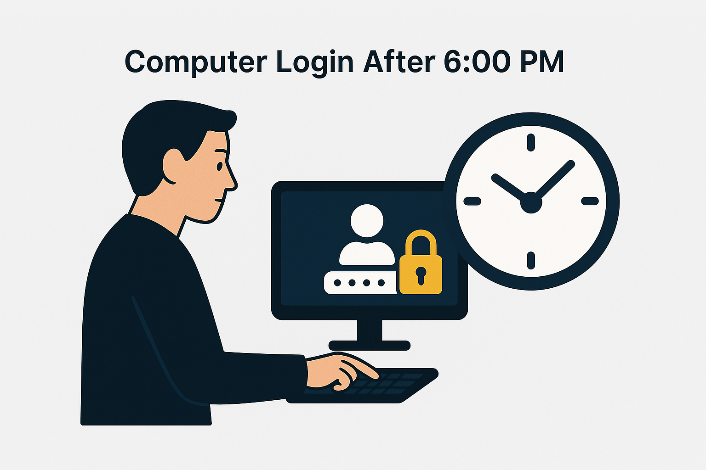
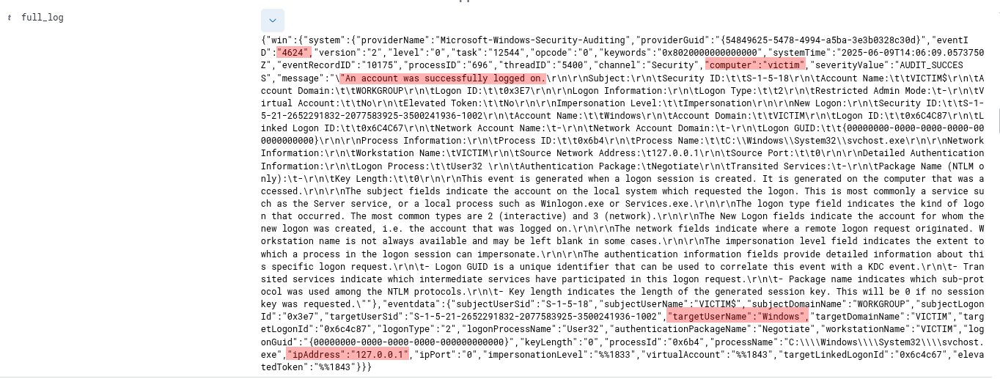
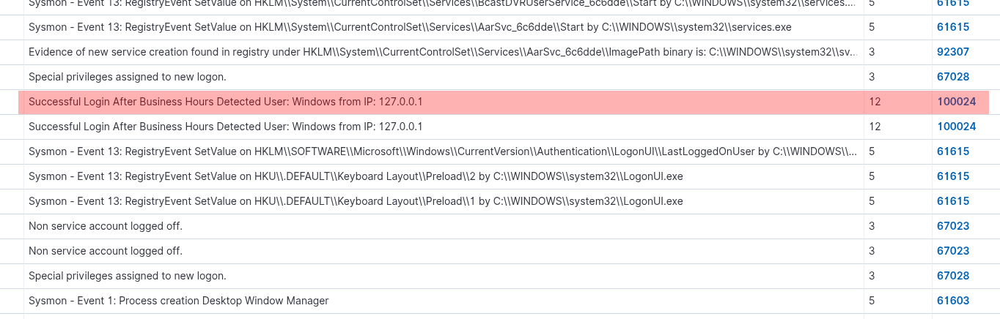
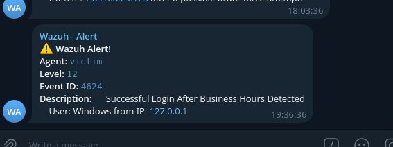

# Detection Use Case: Successful Login After Business Hours


## Scenario Description
This detection identifies successful login attempts occurring outside standard business hours. In this setup, a login attempt made after 6:00 PM using valid credentials may indicate suspicious activity, especially if it’s unusual for the user or organization.

## Objective
To detect potentially unauthorized or suspicious access by monitoring valid logins occurring after regular business hours (6:00 PM - 8:30 AM).

## Tools Used
- **SIEM**: Wazuh  
- **Log Source**: Windows Security Logs  
- **Environment**:
  - Windows 11 with Wazuh agent and Sysmon installed.
  - Centralized Wazuh Manager for alert correlation and forwarding.
  - Custom detection rule for after-hours successful logins.

## Event ID / Rule ID / Data Source Mapping

| Source        | Event ID / Field              | Description                        |
|---------------|-------------------------------|------------------------------------|
| Windows Logs  | 4624                          | Successful Logon                   |
| Wazuh Rule    | 60106                         | Windows Logon Success              |
| Custom Rule   | 100024                        | Successful Login After Hours       |

## Detection Logic / Rules

### Rule 1: Detect Standard Windows Logon Success
```xml
<rule id="60106" level="3">
  <field name="win.system.eventID">^4624$</field>
  <description>Windows Logon Success</description>
  <options>no_full_log</options>
  <group>authentication_success</group>
  <mitre>
    <id>T1078</id>
  </mitre>
</rule>
```

### Rule 2: Custom Rule-  Detect Successful Login After Business Hours
```xml
<rule id="100024" level="12">
  <if_sid>60106</if_sid>
  <time>6 pm - 8:30 am</time>
  <description>
    Successful Login After Business Hours Detected
    User: $(win.eventdata.targetUserName) from IP: $(win.eventdata.ipAddress)
  </description>
  <mitre>
    <id>T1078</id> <!-- Valid Accounts -->
  </mitre>
</rule>
```

### Alternate Rule Option (May Produce Duplicates) Using EventID - 4624
```xml
<rule id="100024" level="12">
  <field name="win.system.eventID" type="pcre2">^4624$</field>
  <time>6 pm - 8:30 am</time>
  <description>
    After-Hours Login Detected - User: $(win.eventdata.targetUserName) 
    from IP: $(win.eventdata.ipAddress)
  </description>
</rule>
```
### Alternate Rule Option (May Produce Duplicates) Using group - authentication_sucess
```xml
<rule id="100024" level="12">
  <if_group>authentication_sucess</if_group>
  <time>6 pm - 8:30 am</time>
  <description>
    After-Hours Login Detected - User: $(win.eventdata.targetUserName) 
    from IP: $(win.eventdata.ipAddress)
  </description>
</rule>
```

```
These alternatives may produce duplicates because Events 
                                        - Windows Sucess Logon 
                                        - Windows Workstation Logon
                                        - Audit Sucesss
Uses similar EventID - 4624 or similar group name - authentication_sucess.
```
## Attack Triggering Scenario

Trigger: A login is made after 6:00 PM using legitimate credentials (e.g., via RDP, console, etc.).

This may indicate:
- Insider threat activity
- Unauthorized access using valid credentials
- Misuse of dormant accounts

## Sample Log Snippets

### ✅ After-Hours Login (4624)
```json
{
  "eventID": "4624",
  "logonType": "10",
  "user": {
    "account_name": "adminuser"
  },
  "ipAddress": "192.168.29.150",
  "timestamp": "2025-06-09T19:45:22Z"
}
```

### 🚨 Correlated Alert
```json
{
  "rule": {
    "id": "100024",
    "description": "Successful Login After Business Hours Detected"
  },
  "source_ip": "192.168.29.150",
  "user": "adminuser",
  "time": "19:45"
}
```

### ✅ Original FInal Log


### 🚨 Alerts 






## Analyst Notes / Recommendations

1. Validate whether after-hours login is routine for the specific user.
2. Review associated system logs and correlate with VPN, email, or network activity.
3. Consider implementing conditional access policies or MFA enforcement during after-hours.
4. Track any lateral movement or privilege escalation activities post-login.

## Detection Status
✅ Successfully triggered using simulated after-hours login attempts and received alerts.
