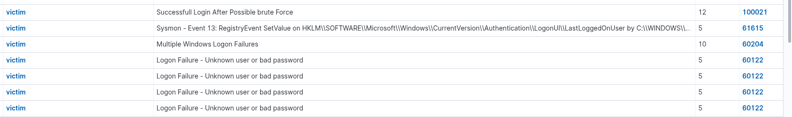
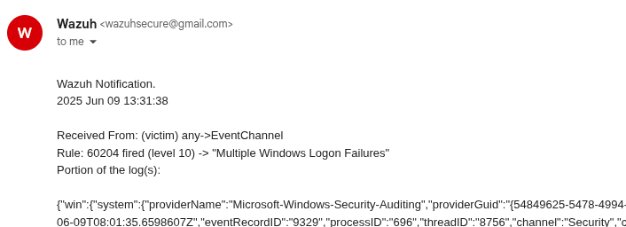
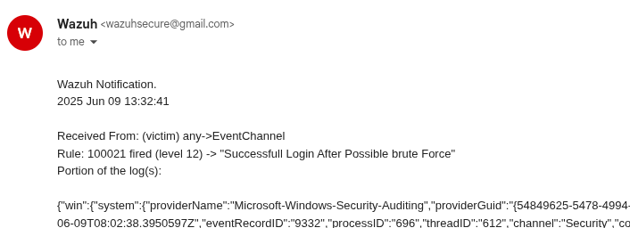
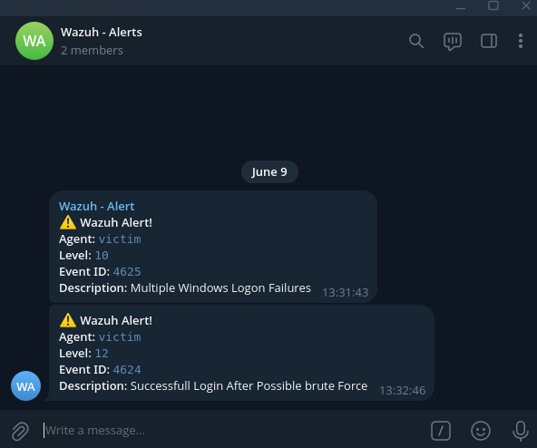

# Detection Use Case: Brute Force Followed by Successful Login

## Scenario Description
This detection identifies a brute force login attempt where multiple failed login events (Event ID 4625) are followed by a successful login (Event ID 4624) from the same IP address. In this scenario, 8 failed login attempts occurred on a desktop machine, followed by one successful login.

## Objective
To detect potential brute force attacks that result in a successful login, which may indicate unauthorized access after credential guessing.

## Tools Used
- SIEM: Wazuh
- Log Source: Windows Event Logs (Secuirty)
- Lab Setup: 
  - One Windows 11 desktop VM with Wazuh agent, Sysmon installed.
  - Default secuirty measures are turned of for testing.
  - Wazuh server running on Kali Linux for centralized log collection and alerting.
  - Alerts configured via email and Telegram.
  

## Event ID / Rule ID /Data Source Mapping
| Source        | Event ID / Field | Description                      |
|---------------|------------------|----------------------------------|
| Windows Logs  | 4625             | Failed login attempt             |
| Windows Logs  | 4624             | Successful login                 |
| Wazuh Rule    | 60204            | Multiple Failed Login            |
| Wazuh Rule    | 60106            | Sucessfull Login                 |
| Custom Rule   | 100021           | Successful Login After Possible Brute Force |

## Detection Logic / Rules

"$MS_FREQ" - Defined 8 (var name="MS_FREQ">8</var>)

1. Detect multiple failed login attempts.
```
<rule id="60204" level="10" frequency="$MS_FREQ" timeframe="240">
  <if_matched_group>authentication_failed</if_matched_group>
  <same_field>win.eventdata.ipAddress</same_field>
  <description>Multiple Windows Logon Failures</description>
  <options>no_full_log</options>
  <mitre>
    <id>T1110</id>
  </mitre>
</rule>
```

2. Detect successful login.
```
<rule id="60106" level="3">
  <field name="win.system.eventID">^528$|^540$|^673$|^4624$|^4769$</field>
  <description>Windows Logon Success</description>
  <options>no_full_log</options>
  <mitre>
    <id>T1078</id>
  </mitre>
</rule>
```

3. Custom rule written for correlate both the above rule.
```
<!-- Rule 3: Correlate both to indicate brute force success -->
<group name="windows_brute_force">
  <rule id="100021" level="12">
    <if_sid>60106</if_sid>
    <if_matched_sid>60204</if_matched_sid>
    <description>Successful Login After Possible Brute Force</description>
  </rule>
</group>
```


## Attack Triggering Scenario

Triggered by attempting 8 consecutive failed login attempts within a short time window, followed by a single successful login attempt from the same IP address.

This behavior is indicative of a credential stuffing or brute-force attack, followed by unauthorized access using valid credentials.

---

### Log - Single Failed Login Attempt (Simple version)
```json
{
  "eventID": "4625",
  "description": "Logon Failure - Unknown user or bad password",
  "agent": {
    "name": "victim",
    "ip": "192.168.29.100"
  },
  "eventTime": "2025-06-09T08:01:00Z",
  "username": "Windows",
  "workstationName": "VICTIM",
  "ipAddress": "127.0.0.1",
  "logonType": "2",
}
```

### Log - Multiple Windows Logon Failures
```json
{
  "eventID": "4624",
  "description": "Multiple Windows Logon Failures",
  "agent": {
    "name": "victim",
    "ip": "192.168.29.100"
  },
  "eventTime": "2025-06-09T08:01:02Z",
  "username": "Windows",
  "workstationName": "VICTIM",
  "ipAddress": "127.0.0.1",
  "logonType": "2",
}
```

### Log - Sucessfull Login Which leads to the trigger of Next rule
```json
{
  "event_id": "4624",
  "event_type": "Successful Login",
  "logon_type": "2",
  "user": {
    "account_name": "Windows",
    "domain_name": "VICTIM",
    "security_id": "S-1-5-21-2652291832-2077583925-3500241936-1002"
  },
  "source": {
    "ip_address": "127.0.0.1",
    "workstation": "VICTIM"
  },
  },
  "rule": {
    "id": "100021",
    "description": "Successful Login After Possible Brute Force",
    "severity_level": 12
  },
  "timestamp": "2025-06-09T13:32:41.020+0530"
}
```

### Evidence / Alerts







### Analyst Notes / Recommendations
1. What should an analyst do when this alert triggers?
   - Investigate the user account involved.
   - Check for lateral movement or privilege escalation.
   - Validate if the login was legitimate (e.g., check with the user or correlate with VPN or remote access logs).
   - Block the IP address or user if unauthorized.

2. Possible false positives?
   - Users who forget passwords and retry multiple times before succeeding.
   - Automated software or scripts triggering multiple failed attempts.

### Detection Status
✅ Alerts successfully tested and received via both Email and Telegram.


