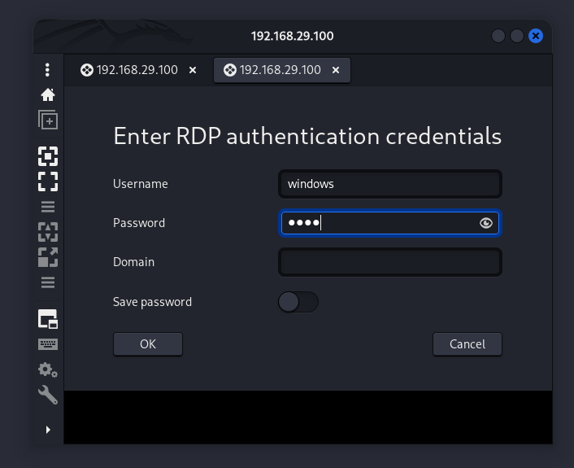
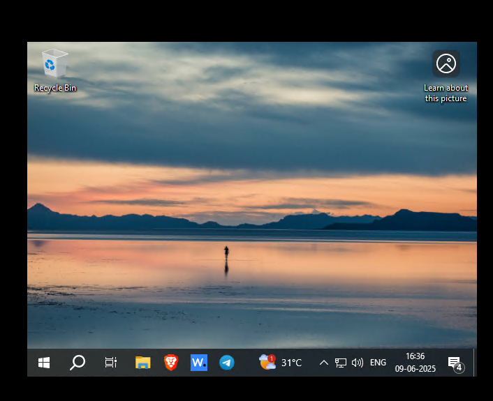
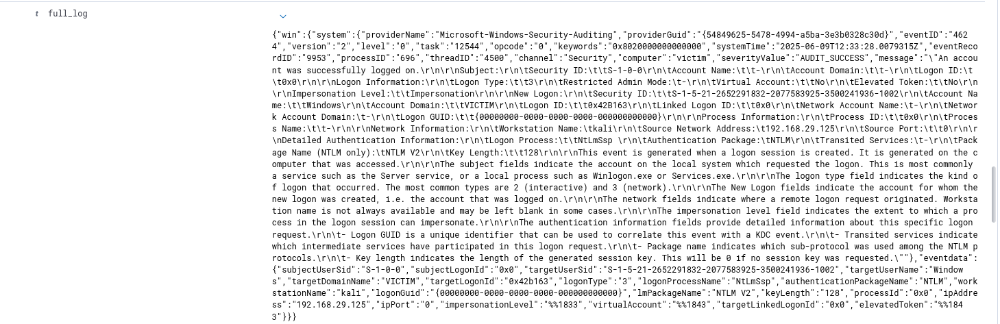
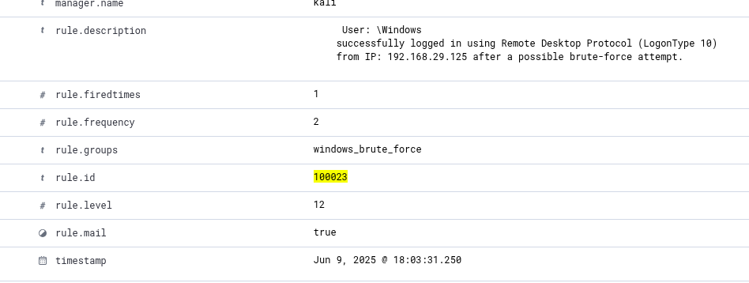
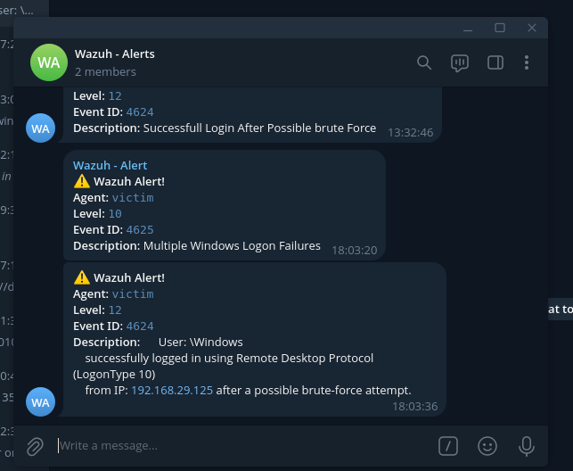

# Detection Use Case: Lateral Movement via RDP After Brute Force


## Scenario Description
This detection identifies a brute force attack on RDP using Hydra, followed by a successful login through Remmina, potentially indicating lateral movement. The attacker uses Kali Linux to target a Windows 11 machine via RDP.

## Objective
To detect lateral movement attempts using RDP, especially when the initial access is obtained by brute-forcing credentials.

## Tools Used
- **SIEM**: Wazuh  
- **Log Source**: Windows Event Logs (Security)  
- **Attack Tool**: Hydra (Brute Force), Remmina (RDP Client)
- **Environment**:
  - Kali Linux (Attacker Machine)
  - Windows 11 VM with Wazuh Agent and Sysmon - RDP configured
  - Wazuh server for centralized alerting

## Event ID / Rule ID / Data Source Mapping

| Source        | Event ID / Field      | Description                               |
|---------------|------------------------|-------------------------------------------|
| Windows Logs  | 4625                   | Failed login attempt                      |
| Windows Logs  | 4624 + LogonType 10    | Successful RDP login                      |
| Wazuh Rule    | 60204                  | Multiple Failed Logins (Brute Force)      |
| Wazuh Rule    | 92657                  | Successful RDP Login                      |
| Logon Type    | 10                     | RDP login
| Custom Rule   | 100022, 100023         | Correlation between brute force and success |

## Detection Logic / Rules

### Rule 1: Detect Multiple Failed Logins (Hydra)
```xml
<rule id="60204" level="10" frequency="8" timeframe="240">
  <if_matched_group>authentication_failed</if_matched_group>
  <same_field>win.eventdata.ipAddress</same_field>
  <description>Multiple Windows Logon Failures Detected</description>
  <mitre>
    <id>T1110</id> <!-- Brute Force -->
  </mitre>
</rule>
```

### Rule 2: Match Successful RDP Logon (LogonType 10)
```xml
<rule id="92657" level="5">
  <field name="win.system.eventID">4624</field>
  <field name="win.eventdata.logonType" type="pcre2">10</field>
  <description>Successful RDP Login Detected</description>
  <mitre>
    <id>T1021.001</id> <!-- Remote Services: Remote Desktop Protocol -->
  </mitre>
</rule>
```

### Rule 3: Custom rule - Correlate Success with Brute Force (Same IP)
```xml
<rule id="100022" level="12">
  <!-- LogonType 10 = RemoteInteractive (RDP) -->
  <field name="win.eventdata.logonType" type="pcre2">10</field>
  <if_matched_sid>60204</if_matched_sid>
  <description>
    User: $(win.eventdata.subjectDomainName)\$(win.eventdata.targetUserName) 
    successfully logged in using RDP (LogonType 10) 
    from IP: $(win.eventdata.ipAddress) after a brute-force attempt.
  </description>
</rule>
```

### Rule 4: Custom rule - Alternate Correlation Using SID
```xml
<rule id="100023" level="12">
  <if_sid>92657</if_sid>
  <if_matched_sid>60204</if_matched_sid>
  <description>
    User: $(win.eventdata.subjectDomainName)\$(win.eventdata.targetUserName) 
    logged in via RDP after brute-force (Hydra) from IP: $(win.eventdata.ipAddress).
  </description>
</rule>
```

## Attack Triggering Scenario
1. Launch brute force using:
   ```bash
   hydra -t 4 -V -f -L username.txt -P /usr/share/wordlists/rockyou.txt rdp://192.168.x.x
   ```

2. After a few failed attempts, gain access using:
   - Remmina GUI with found credentials.

<p align="center">
  
  
</p>


## Sample Log Snippets

### 🔐 Failed Logon Event (4625)
```json
{
  "eventID": "4625",
  "description": "Logon Failure",
  "ipAddress": "192.168.29.150",
  "logonType": "10"
}
```

### ✅ Successful RDP Login (4624 - LogonType 10)
```json
{
  "eventID": "4624",
  "logonType": "10",
  "user": {
    "account_name": "administrator"
  },
  "ipAddress": "192.168.29.150"
}
```

### 🚨 Correlated Alert Log
```json
{
  "rule": {
    "id": "100023",
    "description": "Successful RDP Login after Brute Force"
  },
  "source_ip": "192.168.29.150",
  "user": "administrator"
}
```

### Original Final Log




## Analyst Notes / Recommendations

1. Check whether RDP was intended or expected for that host.
2. Review firewall/network logs to verify lateral movement.
3. Consider isolating the affected system and rotating credentials.
4. Search for related suspicious activities (e.g., process injection, privilege escalation).

## Detection Status
✅ Sucessfully Triggered and received alerts.
