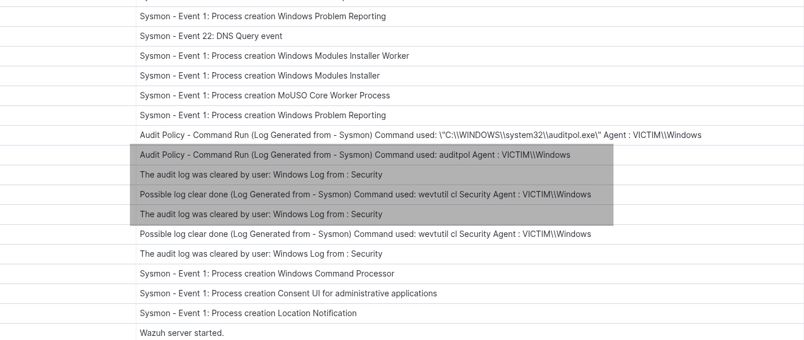
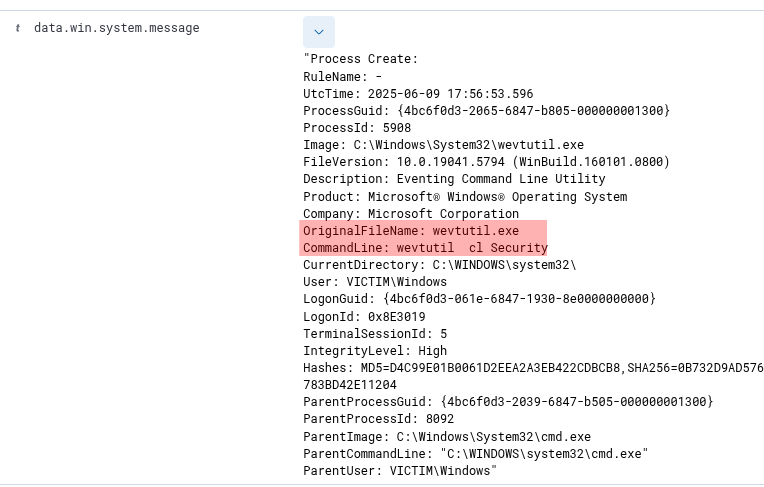
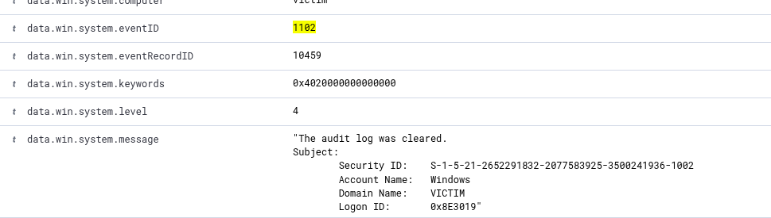
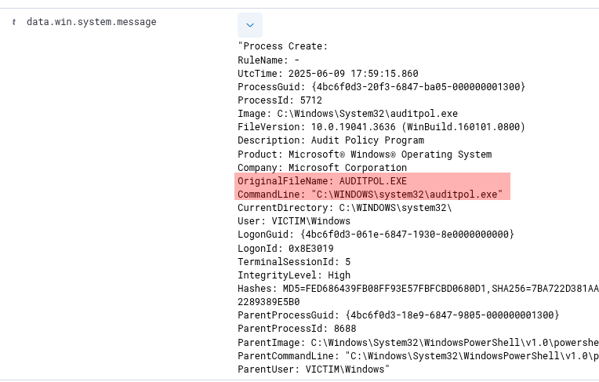
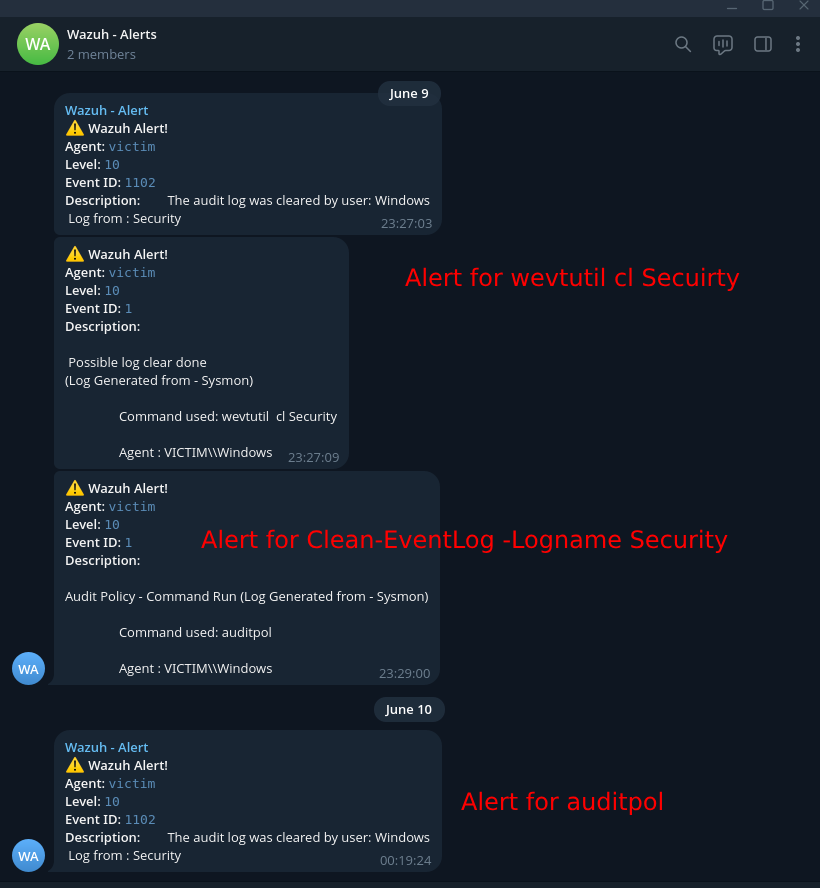

# Log Tampering Simulation Detection

## Scenario

This simulation involves detecting potential log tampering activities in a Windows environment. The attacker attempts to clear logs using tools like `wevtutil`, `auditpol`, and PowerShell cmdlets such as `Clear-EventLog`.


## Tools Used
- **SIEM**: Wazuh  
- **Log Source**: Windows Security Logs , Sysmon logs
- **Environment**:
  - Windows 11 with Wazuh agent and Sysmon installed.
  - Centralized Wazuh Manager for alert correlation and forwarding.
  - Tools - wevtutil, Clear-EventLog, auditpol


## Event ID / Rule ID / Data Source Mapping

| Source        | Event ID / Field              | Description                        |
|---------------|-------------------------------|------------------------------------|
| Sysmon        | 1                             | Process creation                   |
| Windows/Security| 1102                        | Audit log cleared                  |
| Custom Rule 1 | 100025                        | Log cleared using wevtutil         |
| Custom Rule 2 | 100026                        | Any possible usage of command auditpol|


## Detection Rules
---
### 1. Base Rule - Security Event Log (1102)
---
**_win.logFileCleared.subjectUserName_ added to the original rule to extract User.**
```xml
<rule id="63103" level="10">
    <if_sid>63108</if_sid>
    <field name="win.system.eventID">^1102$</field>
    <description>
      The audit log was cleared by user: $(win.logFileCleared.subjectUserName)
        Log from : Security
    </description>
    <mitre>
      <id>T1070</id>
    </mitre>
    <group>log_clearing_auditlog,gpg13_10.1,gdpr_II_5.1.f,gdpr_IV_30.1.g,</group>
</rule>
```

### 2. Base Rule 2 - Sysmon Event ID - 1 - Process Creation

```xml
<rule id="61603" level="5">
  <if_sid>61600</if_sid>
  <field name="win.system.eventID">^1$</field>
  <description>Sysmon - Event 1: Process creation $(win.eventdata.description)</description>
  <group>sysmon_event1,</group>
</rule>
```

### 3. Custom Rules - Group: `log_tamper`

**To identify usage of _wevtutil/auditpol_**

```xml
<group name="log_tamper">
<rule id="100025" level="10">
  <if_sid>61603</if_sid>
  <field name="win.eventdata.originalFileName">^wevtutil.exe$</field>
  <description> 
    Possible log clear done (Log Generated from - Sysmon)  
    Command used: $(win.eventdata.commandLine)  
    Agent : $(win.eventdata.user)
  </description>
  <group>sysmon, suspicious, windows</group>
</rule>

<rule id="100026" level="10">
  <if_sid>61603</if_sid>
  <field name="win.eventdata.originalFileName">^AUDITPOL.EXE$</field>
  <description> 
    Audit Policy - Command Run (Log Generated from - Sysmon)  
    Command used: $(win.eventdata.commandLine)  
    Agent : $(win.eventdata.user)
  </description>
  <group>sysmon, suspicious, windows</group>
</rule>
</group>
```
---
## Trigger Scenarios
---
These commands are run

### `wevtutil cl <command>`
  - Triggers Base Rule 1 (Event ID 1102)
  - Triggers Sysmon Rule 61603 leading to detection via rule `100025`
  - Works even if executed via PowerShell
  - As the condition is .originalFileName, It can identify all possible commands of wevtutil

```
    wevtutil cl Security
    wevtutil cl System
    wevtutil cl Application
```

**Log**





### `Clear-EventLog -Logname <command>`

  - Triggers Base Rule 1 - 
  - Used in powershell only
  - As the condition is based on 1102, It can identify all possible -Logname
    ```
    Clear-EventLog -Logname Security
    Clear-EventLog -Logname Application
    Clear-EventLog -Logname System
    ```
**Log**

    
    
### `auditpol <command>'
  - Triggers Sysmon Rule 61603 leading to detection via rule `100026`
  - Works even if executed via PowerShell
  - As the condition is .originalFileName, It can identify all possible commands of auditpol
    ```
    auditpol #Even this will be alerted
    auditpol /set /subcategory:"Logon" /success:enable /failure:enable
    auditpol /clear
    ```
**Log**





<p align="center">
  
</p>

---
## 🔍 Analytical Notes & ✅ Recommendations
---
- Suspicious use of log-clearing commands may indicate attacker log tampering.
- Event ID 1102 (log cleared) is a key indicator of suspicious behavior.
- Sysmon Event ID 1 can reveal process creation related to tampering.
- Combine Security and Sysmon logs for higher detection accuracy.
- Flag log tampering attempts as high severity for immediate response.
- Forward logs to a central SIEM to prevent local deletion.
- Restrict tools like `wevtutil` and `auditpol` using AppLocker/WDAC.
- Monitor and control PowerShell usage with execution policies.
- Investigate prior events if log tampering is detected.
- Include such scenarios in regular blue team exercises.

---
## Detection status
✅ Sucessfully Triggered and received the proper alerts.
---
