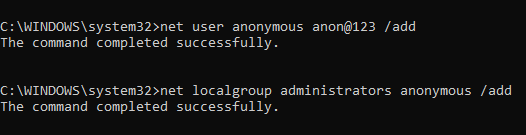
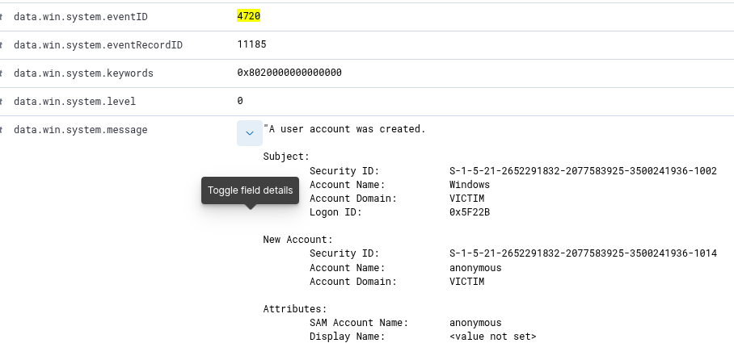
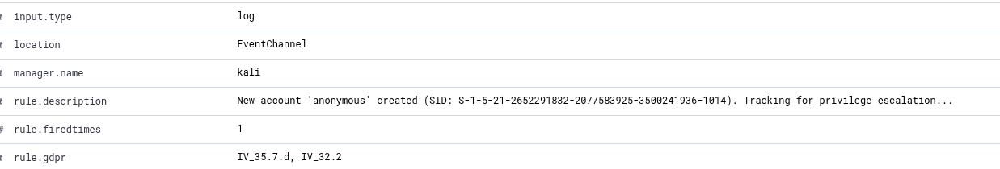
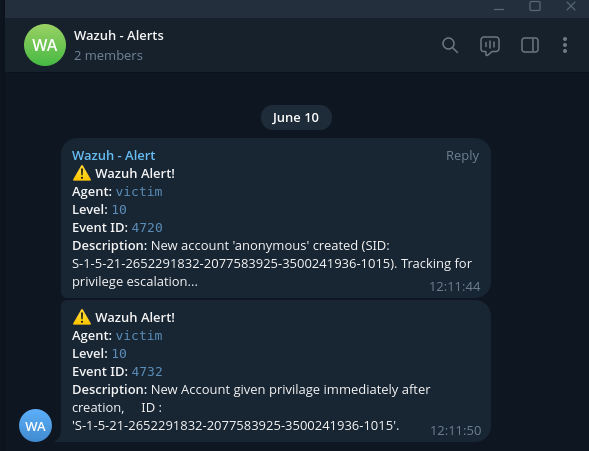

# Detection Use Case: New User Account Creation Followed by Privilege Escalation


## Scenario Description
This detection identifies a suspicious behavior pattern where a new user account is created (Event ID 4720), followed by the addition of the user to the local Administrators group (Event ID 4732). This activity, especially if it occurs after business hours, may indicate unauthorized privilege escalation.

## Objective
To detect potentially malicious user creation and privilege escalation, particularly during non-business hours, which may suggest lateral movement or privilege abuse.

---

## Tools Used
- **Command Line Utility**: `net` command

- **SIEM**: Wazuh
- **Log Source**: Windows Event Logs (Security)
- **Lab Setup**:
  - One Windows 11 VM with Wazuh agent and Sysmon installed.
  - Wazuh server on Kali Linux for centralized log analysis.
  - Default security restrictions relaxed for test purposes.
  - Alerts configured for Telegram delivery.

---

## Event ID / Rule ID / Data Source Mapping
| Source        | Event ID / Field | Description                              |
|---------------|------------------|------------------------------------------|
| Windows Logs  | 4720             | New user account created                 |
| Windows Logs  | 4732             | User added to local group (Administrators) |
| Wazuh Rule    | 60109            | New User Creation Detected               |
| Custom Rule    | 100103            | Privilege Escalation Detected (immediate)         |
| Custom Rule   | 100032           | New User Created After Hours       |

---

## Detection Logic / Rules

### 1. Detect new user account creation - Event ID - 4720
**_<description>New account '$(win.eventdata.targetUserName)' created (SID: $(win.eventdata.targetSid)). Tracking for privilege escalation...</description>_**
**Customized version which send alerts with more data for better understanding through alert itself**

```xml
<rule id="60109" level="10">
    <if_sid>60103</if_sid>
    <field name="win.system.eventID">^624$|^626$|^4720$</field>
    <description>New account '$(win.eventdata.targetUserName)' created (SID: $(win.eventdata.targetSid)). Tracking for privilege escalation...</description>
    <options>no_full_log</options>
    <group>adduser,account_changed,</group>
    <group>pci_dss_8.1.2,pci_dss_10.2.5,gpg13_7.10,gdpr_IV_35.7.d,gdpr_IV_32.2,hipaa_164.312.a.2.I,hipaa_164.312.a.2.II,hipaa_164.312.b,nist_800_53_AC.2,nist_800_53_IA.4,nist_800_53_AU.14,nist_800_53_AC.7,tsc_CC6.8,tsc_CC7.2,tsc_CC7.3,</group>
    <mitre>
      <id>T1098</id>
    </mitre>
  </rule>
```

### 2. Detect privilege escalation (user added to local Administrators group) Event ID - 4732.

**'$(win.eventdata.memberSid)'**
**Customized version which send alerts with more data for better understanding through alert itself**

```xml
<rule id="100103" level="10" timeframe="60">
    <if_matched_sid>60109</if_matched_sid>
    <if_sid>60154</if_sid> <!-- Rule to identify group changes (Already exist) -->
    <description>New Account given privilage immediately after creation,
    ID : '$(win.eventdata.memberSid)'.</description>
</rule>
```

### 3. Custom rule to detect account creation after buisness hours.

```xml
<rule id="100032" level="12">
  <if_sid>60109</if_sid>
  <time>6 pm - 8:30 am</time>
  <description>New account '$(win.eventdata.targetUserName)' created (SID: $(win.eventdata.targetSid)). After Buisness Hours</description>
</rule>
```

---

## Attack Triggered using below commands

### `net user <username> <password> /add` – Create a new user.

**Log - Alert** 

<p align="center">
  
  
</p>

   
### `net localgroup administrators <username> /add` – Add user to Administrators groups.

**Log - Alert**

<p align="center">
  
  
</p>
    
---

### Evidence / Alerts

<p align="center">
  
</p>


---

### Analyst Notes / Recommendations
1. **What should an analyst do when this alert triggers?**
   - Validate if account creation was authorized.
   - Confirm if activity occurred outside business hours.
   - Investigate login activity and account usage.
   - Disable or remove the user account if deemed malicious.

2. **Possible false positives?**
   - Legitimate admin actions during maintenance windows.
   - Service accounts being created and escalated by scripts.

---

### Detection Status
✅ Detection tested successfully with alerts triggered and received via Telegram and Wazuh.
