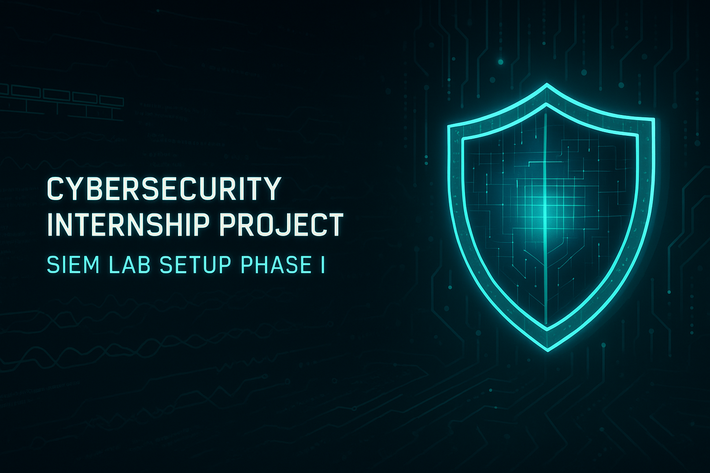

# 🛡️ Phase I: Foundation Setup — Your Cybersecurity War Room


**Duration:** Day 1 — Day 7  
**Objective:** Build a personal cybersecurity lab environment and configure basic monitoring and detection capabilities.

---

## 🎯 Phase Goals

- Set up a virtual SOC environment
- Configure log generation and forwarding
- Implement basic detection rules
- Track progress and maintain documentation

---

## 🛠️ Tools Used

| Category        | Tool              |
|----------------|-------------------|
| SIEM            | Wazuh             |
| Log Source      | Windows 11 (On-premise desktop)   |
| Log Agent       | Wazuh Agent, Sysmon|
| Wazuh Manager/Indexer/Dashboard + Attacker | Kali Linux (On-premise Laptop) |

---

## 💻 1. Installing Windows 11 (Victim Machine)

### Steps:
1. Downloaded ISO from official Microsoft site:  
   🔗 [Windows 11 ISO](https://www.microsoft.com/en-us/software-download/windows11)
2. Created bootable USB using [Ventoy](https://www.ventoy.net/en/download.html)
3. Installed Windows 11 on desktop hardware
4. Performed initial updates and created a local admin account

---

## 🧰 2. Installing Wazuh Components (Laptop)

The following components were installed manually on the laptop:

### 🖥️ Wazuh Stack Components:
- **Wazuh indexer - 🔗[Step by step Installation](https://documentation.wazuh.com/current/installation-guide/wazuh-indexer/step-by-step.html)**
- **Wazuh Server -  🔗[Step by step Installation](https://documentation.wazuh.com/current/installation-guide/wazuh-server/step-by-step.html)**
- **Wazuh Dashboard - 🔗[Step by step Installation](https://documentation.wazuh.com/current/installation-guide/wazuh-dashboard/step-by-step.html)****

<p align="center">
  
  
  
</p>


### Installation Reference:
- Official Wazuh all-in-one script:  
```bash
curl -sO https://packages.wazuh.com/4.7/wazuh-install.sh
sudo bash ./wazuh-install.sh -a
```
  🔗 [Install Wazuh on Single-Host](https://documentation.wazuh.com/current/installation-guide/installing-wazuh-server/wazuh-single-node/index.html)
🔗 [Official Documentation](https://documentation.wazuh.com/current/installation-guide/installing-wazuh-server/wazuh-single-node/index.html)


## 2️⃣ Log Agent Installation & Configuration

### ✔️ Installed Sysmon
- Used `Sysinternals` from Microsoft
- Configured with a recommended template

📥 Download: [Sysmon](https://learn.microsoft.com/en-us/sysinternals/downloads/sysmon)  
📄 Template: [SwiftOnSecurity Sysmon Config](https://github.com/SwiftOnSecurity/sysmon-config)

📸 Screenshot:  


---

### ✔️ Installed Winlogbeat
- Configured Winlogbeat to send logs to Wazuh
- Edited `winlogbeat.yml` to enable Wazuh output

📥 Download: [Winlogbeat](https://www.elastic.co/downloads/beats/winlogbeat)

📸 Screenshot:  


---

## 3️⃣ Log Collection Verification

- Checked Wazuh dashboard for incoming logs
- Verified Sysmon logs for process creation, network events, and login attempts

📸 Screenshot:  


---

## 4️⃣ Summary

Successfully completed foundational setup of a SOC-style lab environment. Logs are flowing from the Windows victim VM to the Wazuh SIEM.

Next up: Detect and alert on brute-force attempts and login anomalies.

---

## 🔗 References & Downloads

See [references.md](./references.md) for all download links and documentation references.
